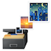

# iPhotoBackup 
<h3>
  This app backup photos from your iDevice to Mac according to the photo list and save file by album.
  

  
[Backing up Structure]

  <ol>
  <li>Connect your iDevice via USB on Mac</li>
  <li>Trust the computer on iDevice (if need)</li>
  <li>Wait for load physical album complete</li>
  <li>Select the photo list(s)</li>
  <li>Click Backup button or Backup All</li>
  </ol>
  ** You need to use "iPhotoAlbum" on iDevice to prepare the backup.
</h3>

《Enquiries and Support》

Email：<a href="mailto:stevenfuture@icloud.com">stevenfuture@icloud.com</a>
 
Supported by：Steven FUNG
